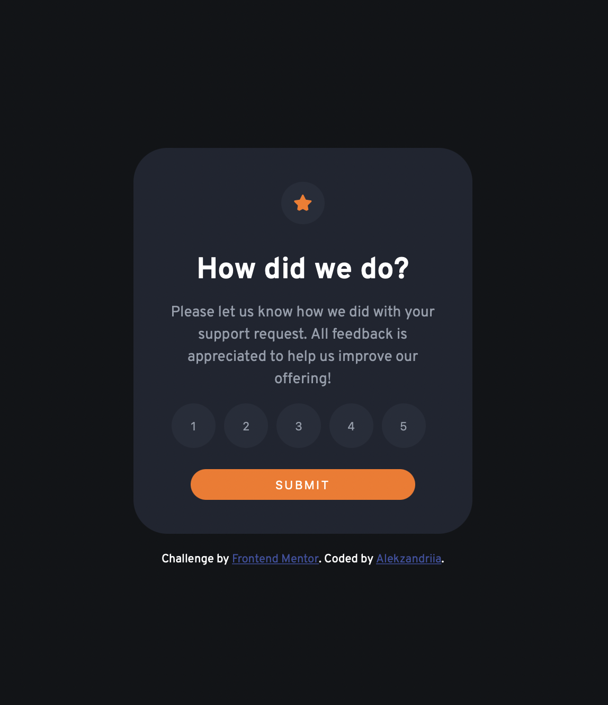
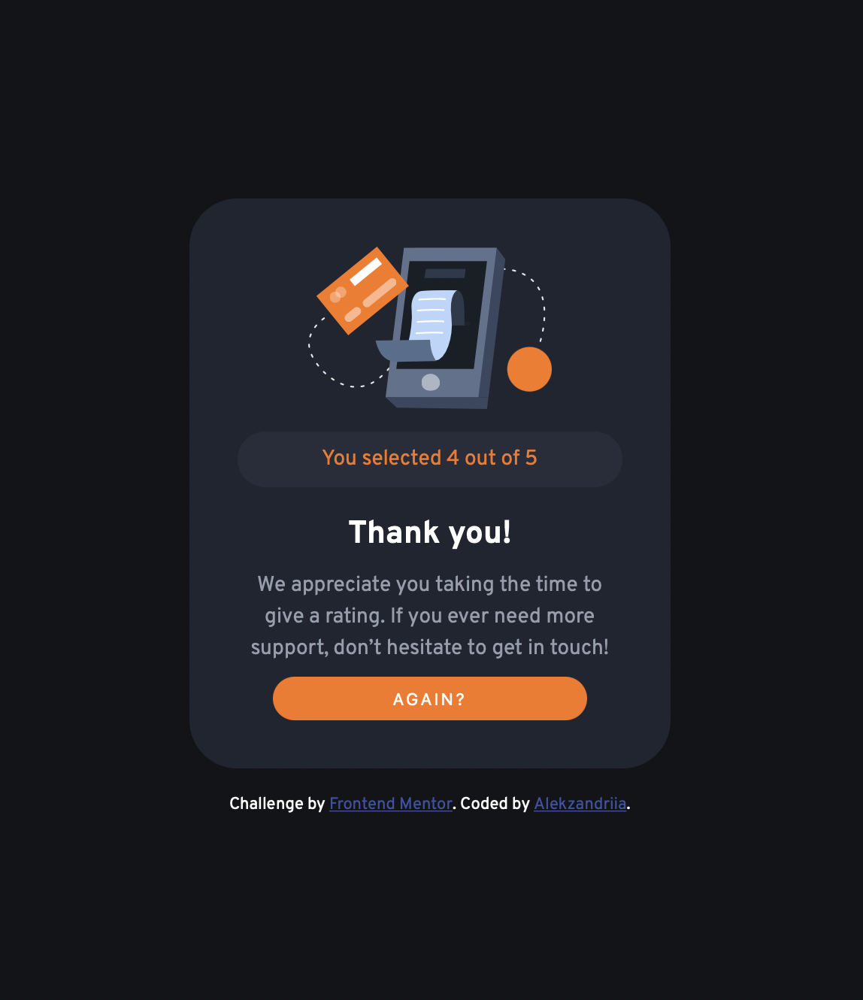

# Frontend Mentor - Interactive rating component solution

This is a solution to the [Interactive rating component challenge on Frontend Mentor](https://www.frontendmentor.io/challenges/interactive-rating-component-koxpeBUmI). Frontend Mentor challenges help you improve your coding skills by building realistic projects.

## Table of contents

- [Overview](#overview)
  - [The challenge](#the-challenge)
  - [Screenshot](#screenshot)
  - [Links](#links)
- [My process](#my-process)
  - [Built with](#built-with)
  - [What I learned](#what-i-learned)
  - [Continued development](#continued-development)
  - [Useful resources](#useful-resources)
- [Author](#author)

## Overview

### The challenge

Users should be able to:

- View the optimal layout for the app depending on their device's screen size
- See hover states for all interactive elements on the page
- Select and submit a number rating
- See the "Thank you" card state after submitting a rating

### Screenshot

### Links

- Solution URL: [Add solution URL here](https://github.com/alekzandriia/interactive-rating)
- Live Site URL: [Add live site URL here](https://alekzandriia.github.io/interactive-rating/)

## My process

### Built with

- Semantic HTML5 markup
- CSS custom properties
- Flexbox
- Mobile-first workflow

### What I learned

I've been working on programming in C, so switching back to JS took a little longer than I expected, but I still managed to get it all done fairly quickly. 👍

### Continued development

Ideally, I'd like for the button that is clicked to maintain the colour change as feedback for the user to know that the button click worked... 🤔 but I also don't want to spend too long on this because I have other homework to work on.

### Useful resources

- [Adding Event Listeners](https://www.freecodecamp.org/news/javascript-addeventlistener-example-code/)

## Author

- Website - [alekz.dev](https://www.alekz.dev)
- Frontend Mentor - [@alekzandriia](https://www.frontendmentor.io/profile/alekzandria)
- Twitter - [@alekzandriia](https://www.twitter.com/alekzandriia)
